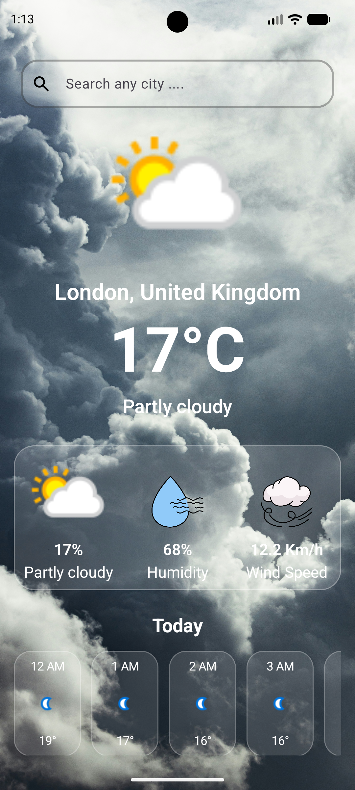

# 🌤 Weather App

A modern Android Weather Application built using Jetpack Compose and MVVM Architecture.

## ✨ Features

- 🔍 Search weather by city
- 🌤 Dynamic background based on weather condition
- 🕒 Hourly weather forecast
- 🌈 Smooth Crossfade background animation
- 📱 Modern Jetpack Compose UI
- ⚡ Fast API calls using Retrofit

## 🛠 Tech Stack

- Kotlin
- Jetpack Compose
- MVVM
- Hilt
- Retrofit
- Coroutines
- Coil

## 📸 Screenshots

(Add your screenshots here)

## 🚀 Getting Started

1. Clone the repository.
2. Add your WeatherAPI key.
3. Run the app.

## 📡 API

Weather data provided by WeatherAPI.

## 📸 Screenshots

  
  

  
  
  

